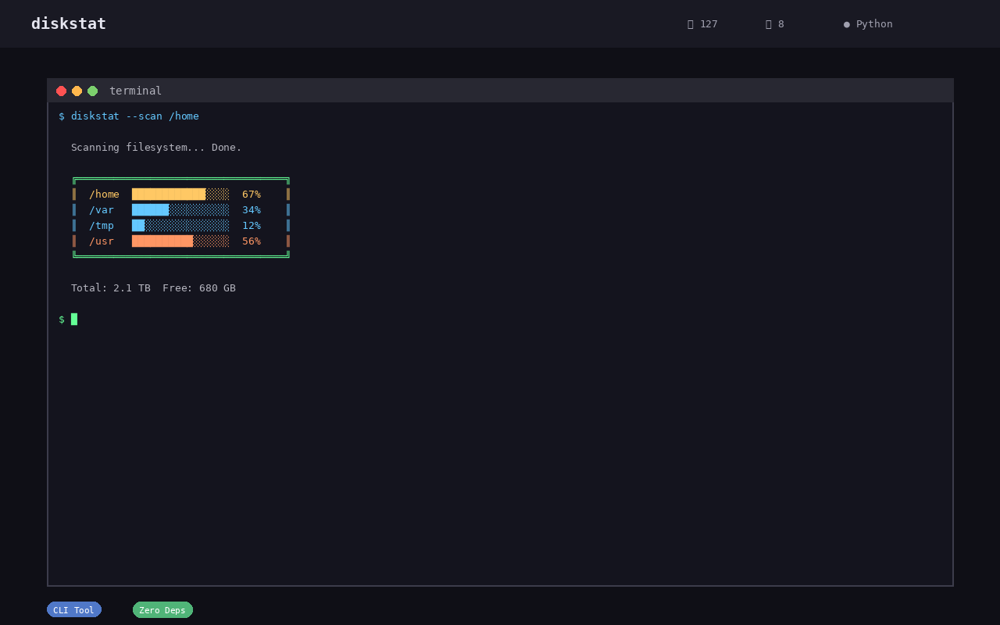

# DiskStat

**Disk usage analysis** — scans a directory and creates an interactive treemap report + CSV output.

[](https://github.com/stennu718/diskstat/actions/workflows/tests.yml)
[](https://opensource.org/licenses/MIT)
[](https://www.python.org/downloads/)
[](https://github.com/stennu718/diskstat/releases)



## Features

- **Interactive treemap** — visual, browser-based disk usage representation
- **CSV export** — structured data for further analysis
- **Cross-platform** — Linux (Docker) and Windows support
- **Zero dependencies** — Python 3.11+ stdlib only
- **Secure** — XSS guards, CSP, symlink safety, subprocess shell=False

## Quick Start

```bash
# Install
pip install -e .

# Scan current directory
python -m diskstat .

# Scan specific path with JSON output
python -m diskstat /path/to/scan --format json

# Docker
docker run --rm -v /path/to/scan:/data stennu718/diskstat /data
```

## Usage

```
python -m diskstat [PATH] [OPTIONS]

Options:
  -o, --out DIR       Output directory (default: diskstat/YYYYMMDD_HHMMSS)
  --open              Open HTML report after creation
  -m, --max-nodes N   Max nodes to visualize (1-500000, default: 5000)
  --format {text,json} Output format
  --progress          Show scan progress
  --min-size BYTES    Skip files smaller than this
  --category CAT      Filter by category (repeatable)
  --exclude DIR       Exclude directory (repeatable: .git, node_modules)
  --sort {size,name}  Sort order (default: size)
  --top N             Show top N largest files (0 = all)
  --reverse           Reverse sort order
  --filter REGEX      Regex filter for filenames (case-insensitive)
  --max-depth N       Maximum scan depth (default: 256)
  --dry-run           Scan only, don't write files
  --no-html           Skip HTML generation (CSV only)
  --config FILE       YAML/JSON config file
  --compare BASELINE  Compare with baseline CSV
  --version           Show version
```

## Architecture

```
diskstat/
├── cli.py          # Argument parsing, entry point
├── scanner.py      # Directory scanning, path resolution
├── renderer.py     # HTML treemap generation, CSV output
├── reporter.py     # Report comparison, output formatting
├── config.py       # Configuration loading, constants
└── template.html   # D3.js treemap template
```

## Security

- **XSS protection** — HTML escaping via `esc()` function
- **CSP header** — Content-Security-Policy meta tag
- **Subprocess safety** — `shell=False` throughout
- **Symlink handling** — `follow_symlinks=False` prevents traversal
- **Input validation** — path existence, readability checks, max_nodes clamp

## Development

```bash
# Run tests
pytest tests/ -v

# Lint
ruff check .

# Type check
mypy diskstat/
```

## Screenshots


*Interactive treemap generated by DiskStat*

## Contributing

See [CONTRIBUTING.md](CONTRIBUTING.md) for details.

## License

MIT
