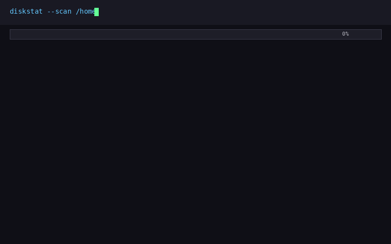

# DiskStat

Find out what's eating your disk space.
Scans any folder and shows you an interactive treemap of where your files are — like WinDirStat, but in your terminal.

**For**: Anyone wondering "why is my disk full?"

## Quick Start

```bash
pip install diskstat
diskstat /path/to/folder
```

That's it. It scans the folder, writes an HTML treemap and a CSV file, and tells you where to find them.

## What you can do

- **See your disk usage as a treemap** — open the HTML report in your browser, click blocks to zoom in, hover for details
- **Export to CSV** — for spreadsheets, scripting, or further analysis
- **Filter and exclude** — skip folders like `.git` or `node_modules`, filter by file type or size
- **Compare scans** — run it twice and see what changed (new files, deleted files, size changes)
- **Pipe from other tools** — use `du | diskstat --stdin` to scan custom inputs
- **Zero dependencies** — only Python 3.11+ needed, nothing else to install
- **Works on Linux, macOS, and Windows**

### Common examples

```bash
# Scan your home folder with a progress bar
diskstat ~ --progress

# Skip small files and junk folders
diskstat /data --min-size 1048576 --exclude .git --exclude node_modules

# Show the 20 largest files
diskstat . --top 20

# Compare today's scan against last week's
diskstat /data --compare diskstat/20240101_120000/files.csv

# Open the report in your browser right away
diskstat . --open
```

## Screenshot




## License

MIT
